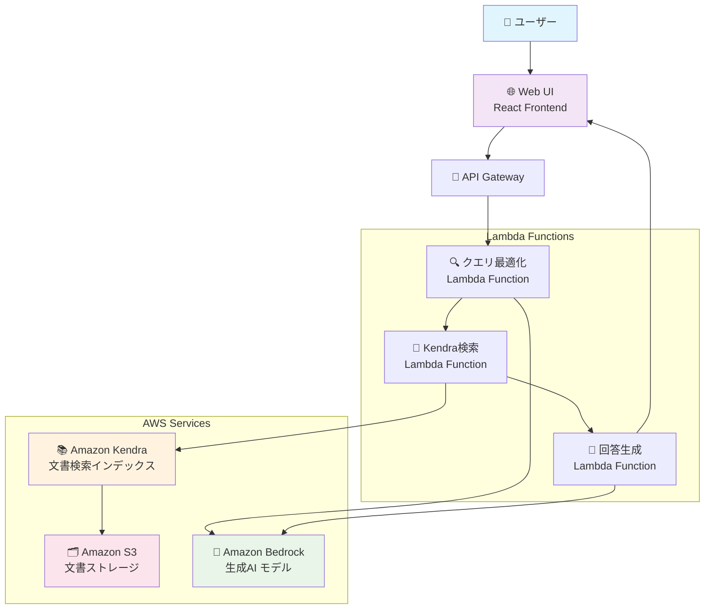
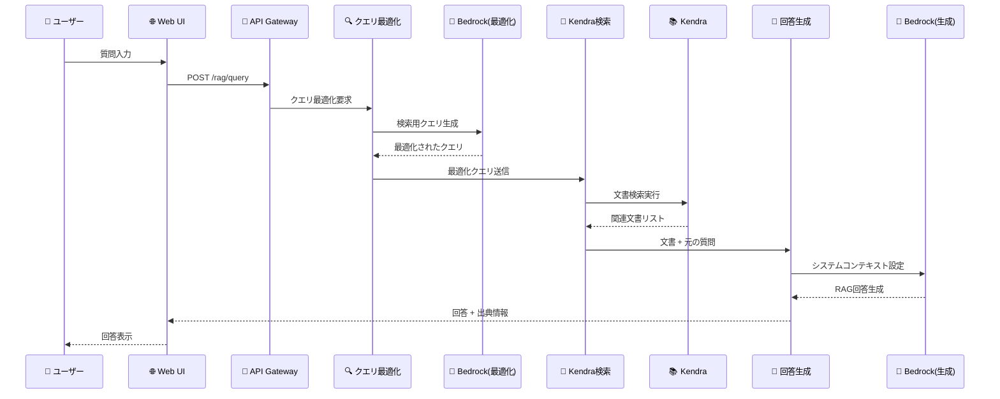

# Amazon Kendra RAG Chat システム構成とプロンプト解説

## 1. システム概要

Amazon Kendraを使用したRAG（Retrieval-Augmented Generation）チャットシステムは、ユーザーの質問に対して関連文書を検索し、それらを基に精度の高い回答を生成する仕組みです。

## 📂 主要ファイル一覧

### フロントエンド（React）
- **`/packages/web/src/pages/RagPage.tsx`** - RAGチャットのメインUI
- **`/packages/web/src/hooks/useRag.ts`** - RAGフローの核となるロジック
- **`/packages/web/src/hooks/useRagApi.ts`** - バックエンドAPIとの通信
- **`/packages/web/src/prompts/claude.ts`** - プロンプトテンプレート定義

### Lambda関数
- **`/packages/cdk/lambda/retrieveKendra.ts`** - Kendraからの文書検索
- **`/packages/cdk/lambda/queryKendra.ts`** - Kendraクエリ実行
- **`/packages/cdk/lambda/predict.ts`** - 単発予測処理
- **`/packages/cdk/lambda/predictStream.ts`** - ストリーミング予測処理

### インフラストラクチャ
- **`/packages/cdk/lib/construct/rag.ts`** - Kendraリソースの定義
- **`/packages/cdk/lib/construct/api.ts`** - API Gateway設定
- **`/packages/cdk/lib/generative-ai-use-cases-stack.ts`** - メインスタック定義

### 設定・型定義
- **`/packages/types/src/chat.d.ts`** - チャット関連の型定義
- **`/packages/cdk/parameter.ts`** - パラメータ設定

## 2. アーキテクチャ図



## 3. 処理フロー詳細

### 3.1 全体のデータフロー



## 4. 主要コンポーネント詳細

### 4.1 フロントエンド（React）

#### 📄 `/packages/web/src/hooks/useRag.ts` - RAGフローの中核ロジック

```typescript
// RAGフローの中核ロジック（46-51行目）
const onSend = useCallback(() => {
  setFollowing(true);
  postMessage(content);  // RAGフロー開始
  setContent('');
}, [content, postMessage, setContent, setFollowing]);
```

#### 📄 `/packages/web/src/pages/RagPage.tsx` - RAGチャットUI

```typescript
// RAGページのメインコンポーネント（使用例）
const RagPage: React.FC = () => {
  const { onSend, content, setContent } = useRag();
  
  return (
    <div className="flex flex-col h-full">
      {/* チャット表示エリア */}
      <div className="flex-1 overflow-y-auto">
        {/* チャットメッセージ */}
      </div>
      
      {/* 入力エリア */}
      <InputChatContent
        content={content}
        onChangeContent={setContent}
        onSend={onSend}
      />
    </div>
  );
};
```

### 4.2 クエリ最適化段階

#### 📄 `/packages/web/src/hooks/useRag.ts` - クエリ最適化処理

**目的**: ユーザーの質問を文書検索に適した形式に変換

```typescript
// Step 1: 検索用クエリの最適化（106-120行目付近）
const query = await predict({
  model: model,
  messages: [
    {
      role: 'user',
      content: prompter.ragPrompt({
        promptType: 'RETRIEVE',
        retrieveQueries: [...prevQueries, content],
      }),
    },
  ],
  id: id,
});
```

#### 📄 `/packages/web/src/hooks/useRagApi.ts` - API通信

```typescript
// Bedrock predict API呼び出し
export const predict = async (params: PredictParams): Promise<string> => {
  const response = await fetch(`/api/predict`, {
    method: 'POST',
    headers: {
      'Content-Type': 'application/json',
    },
    body: JSON.stringify(params),
  });
  
  return response.text();
};
```

### 4.3 検索クエリ生成プロンプト

#### 📄 `/packages/web/src/prompts/claude.ts` - プロンプトテンプレート定義

```typescript
// RETRIEVE用プロンプトテンプレート（290-315行目付近）
ragPrompt(params: RagParams): string {
  if (params.promptType === 'RETRIEVE') {
    return `あなたは文書検索のためのクエリを生成するAIアシスタントです。
<クエリ生成手順>に従ってクエリを生成してください。

<クエリ生成手順>
* <クエリ履歴>の内容を理解してください
* 「〜とは何ですか？」のような質問は「〜の概要」に置き換えてください
* 最新のクエリを基に30トークン以内でクエリを生成してください
* 主語の補完が必要な場合は、<クエリ履歴>の内容を使用してください
* 「〜について」「〜を教えて」「〜を説明して」などの接尾語は使用しないでください
* 生成されたクエリのみを出力してください
</クエリ生成手順>

<クエリ履歴>
${params.retrieveQueries!.map((q) => `* ${q}`).join('\n')}
</クエリ履歴>`;
  }
}
```

#### 📄 `/packages/types/src/chat.d.ts` - 型定義

```typescript
// RAGパラメータの型定義
export type RagParams = {
  promptType: 'RETRIEVE' | 'SYSTEM_CONTEXT';
  retrieveQueries?: string[];
  referenceItems?: RetrieveResultItem[];
};
```

### 4.4 Kendra文書検索

#### 📄 `/packages/cdk/lambda/retrieveKendra.ts` - Kendra検索実行

```typescript
// Kendraから関連文書を取得（40-55行目付近）
const retrieveCommand = new RetrieveCommand({
  IndexId: INDEX_ID,
  QueryText: query,
  AttributeFilter: {
    AndAllFilters: [
      {
        EqualsTo: {
          Key: '_language_code',
          Value: { StringValue: LANGUAGE },
        },
      },
    ],
  },
});
const retrieveRes = await kendra.send(retrieveCommand);
```

#### 📄 `/packages/cdk/lambda/utils/auth.ts` - 認証処理

```typescript
// Lambda関数での認証ヘルパー
export const getAuthenticatedUser = (event: APIGatewayProxyEvent) => {
  const userId = event.requestContext.authorizer?.claims?.sub;
  if (!userId) {
    throw new Error('Unauthorized');
  }
  return userId;
};
```

#### 📄 `/packages/web/src/hooks/useRagApi.ts` - 検索API呼び出し

```typescript
// Kendra検索API呼び出し
export const retrieve = async (query: string): Promise<RetrieveResponse> => {
  const response = await fetch('/api/rag/retrieve', {
    method: 'POST',
    headers: {
      'Content-Type': 'application/json',
    },
    body: JSON.stringify({ query }),
  });
  
  return response.json();
};
```

### 4.5 文書の重複除去処理

#### 📄 `/packages/web/src/hooks/useRag.ts` - 文書統合処理

```typescript
// 同じ文書・ページの内容をマージ（190-210行目付近）
const uniqueKeyOfItem = (item: RetrieveResultItem): string => {
  const pageNumber = item.DocumentAttributes?.find(
    (a: DocumentAttribute) => a.Key === '_excerpt_page_number'
  )?.Value?.LongValue ?? '';
  const uri = item.DocumentURI;
  return `${uri}_${pageNumber}`;
};

export const arrangeItems = (items: RetrieveResultItem[]): RetrieveResultItem[] => {
  const res: Record<string, RetrieveResultItem> = {};
  
  for (const item of items) {
    const key = uniqueKeyOfItem(item);
    if (res[key]) {
      // 同じソースの内容は「...」で連結
      res[key].Content += ' ... ' + item.Content;
    } else {
      res[key] = item;
    }
  }
  
  return Object.values(res);
};
```

#### 📄 `/packages/types/src/chat.d.ts` - 検索結果の型定義

```typescript
// Kendra検索結果の型定義
export interface RetrieveResultItem {
  Id?: string;
  DocumentId?: string;
  DocumentTitle?: string;
  DocumentURI?: string;
  Content?: string;
  DocumentAttributes?: DocumentAttribute[];
  ScoreAttributes?: ScoreAttributes;
}

export interface DocumentAttribute {
  Key: string;
  Value: {
    StringValue?: string;
    LongValue?: number;
    DateValue?: Date;
  };
}
```

### 4.6 システムコンテキスト設定

#### 📄 `/packages/web/src/hooks/useRag.ts` - システムコンテキスト更新

```typescript
// 検索された文書でシステムコンテキスト更新（130-137行目付近）
updateSystemContext(
  prompter.ragPrompt({
    promptType: 'SYSTEM_CONTEXT',
    referenceItems: items,
  })
);
```

#### 📄 `/packages/web/src/hooks/useChat.ts` - チャット状態管理

```typescript
// システムコンテキストの更新処理
const updateSystemContext = useCallback((context: string) => {
  setSystemContext(context);
}, []);

// チャット送信処理
const postMessage = useCallback(
  (
    content: string,
    systemContext?: string,
    preprocessing?: (messages: ShownMessage[]) => ShownMessage[],
    postprocessing?: (message: string) => string
  ) => {
    // システムコンテキストを含むメッセージの送信処理
  },
  [messages, model]
);
```

### 4.7 システムコンテキスト用プロンプト

#### 📄 `/packages/web/src/prompts/claude.ts` - RAGシステムの核となるプロンプト

```typescript
// SYSTEM_CONTEXT用プロンプトテンプレート（320-365行目付近）
ragPrompt(params: RagParams): string {
  if (params.promptType === 'SYSTEM_CONTEXT') {
    return `あなたはユーザーの質問に回答するAIアシスタントです。
以下の手順に従ってユーザーの質問に回答してください。

<回答手順>
* <参考文書>の内容を理解してください
* <回答ルール>の内容を理解してください
* ユーザーの質問がチャットで入力されます
</回答手順>

<参考文書のJSONフォーマット>
{
"SourceId": データソースのID,
"DocumentId": "文書を一意に識別するID",
"DocumentTitle": "文書のタイトル",
"Content": "文書の内容。この内容に基づいて回答してください。",
}[]
</参考文書のJSONフォーマット>

<参考文書>
[
${params.referenceItems!.map((item, idx) => {
  return `${JSON.stringify({
    SourceId: idx,
    DocumentId: item.DocumentId,
    DocumentTitle: item.DocumentTitle,
    Content: item.Content,
  })}`;
}).join(',\n')}
]
</参考文書>

<回答ルール>
* <参考文書>に基づいて質問に回答してください
* 参考にした文書のSourceIdを[^<SourceId>]の形式で追加してください
* <参考文書>で回答できない場合は「質問に回答するために必要な情報を見つけることができませんでした。」と出力してください
* 回答以外のテキストは出力しないでください
* 回答はMarkdownで描画されることに注意してください
</回答ルール>`;
  }
}
```

#### 📄 `/packages/web/src/prompts/index.ts` - プロンプト管理

```typescript
// プロンプタークラスのインスタンス作成
import { ClaudePrompter } from './claude';

export const prompter = new ClaudePrompter();
```

### 4.8 回答生成と脚注処理

#### 📄 `/packages/web/src/hooks/useRag.ts` - 前処理（過去メッセージから脚注削除）

```typescript
// 前処理: Few-shot用に過去ログから脚注を削除（140-150行目付近）
const preprocessing = (messages: ShownMessage[]) => {
  return messages.map((message) => ({
    ...message,
    content: message.content
      .replace(/\[\^0\]:[\s\S]*/s, '') // 末尾の脚注を削除
      .replace(/\[\^(\d+)\]/g, '') // 脚注アンカーを削除
      .trim(),
  }));
};
```

#### 📄 `/packages/web/src/hooks/useRag.ts` - 後処理（脚注情報追加）

```typescript
// 後処理: 脚注とドキュメントリンクを追加（150-170行目付近）
const postprocessing = (message: string) => {
  const footnote = items
    .map((item, idx) => {
      const _excerpt_page_number = item.DocumentAttributes?.find(
        (attr) => attr.Key === '_excerpt_page_number'
      )?.Value?.LongValue;
      return message.includes(`[^${idx}]`)
        ? `[^${idx}]: [${item.DocumentTitle}${
            _excerpt_page_number ? `(${_excerpt_page_number} ページ)` : ''
          }](${item.DocumentURI ? cleanEncode(item.DocumentURI) : ''}${
            _excerpt_page_number ? `#page=${_excerpt_page_number}` : ''
          })`
        : '';
    })
    .filter((x) => x)
    .join('\n');
  return message + '\n' + footnote;
};
```

#### 📄 `/packages/web/src/utils/utils.ts` - URL エンコーディング

```typescript
// URL の安全なエンコーディング処理
export const cleanEncode = (uri: string): string => {
  return encodeURI(uri.replace(/[<>"{}|\\^`\[\]]/g, ''));
};
```

#### 📄 `/packages/cdk/lambda/predict.ts` - 予測処理実行

```typescript
// Bedrock予測処理（20-40行目付近）
export const handler = async (event: APIGatewayProxyEvent): Promise<APIGatewayProxyResult> => {
  const userId = getAuthenticatedUser(event);
  const { messages, model } = JSON.parse(event.body || '{}');
  
  // Bedrock API呼び出し
  const response = await predict({
    messages: messages,
    model: model,
    userId: userId,
  });
  
  return {
    statusCode: 200,
    headers: {
      'Content-Type': 'application/json',
      'Access-Control-Allow-Origin': '*',
    },
    body: JSON.stringify(response),
  };
};
```

## 5. インフラストラクチャ設定

### 5.1 Kendraインデックス設定

#### 📄 `/packages/cdk/lib/construct/rag.ts` - Kendraリソース定義

```typescript
// Kendraインデックスの設定（190-205行目付近）
const indexProps: kendra.CfnIndexProps = {
  name: `generative-ai-use-cases-index${envSuffix}`,
  edition: 'DEVELOPER_EDITION',
  roleArn: indexRole.roleArn,
  userContextPolicy: 'USER_TOKEN', // トークンベースのアクセス制御
  userTokenConfigurations: [{
    jwtTokenTypeConfiguration: {
      keyLocation: 'URL',
      userNameAttributeField: 'cognito:username',
      groupAttributeField: 'cognito:groups',
      url: `${props.userPool.userPoolProviderUrl}/.well-known/jwks.json`,
    },
  }],
};
```

#### 📄 `/packages/cdk/parameter.ts` - パラメータ設定

```typescript
// Kendraの設定パラメータ
export const kendraIndexLanguage = 'ja'; // 日本語設定
export const kendraIndexEdition = 'DEVELOPER_EDITION'; // 開発版
```

### 5.2 S3データソース設定

#### 📄 `/packages/cdk/lib/construct/rag.ts` - S3データソース定義

```typescript
// S3データソースの設定（280-295行目付近）
const dataSourceProps: kendra.CfnDataSourceProps = {
  indexId: index.attrId,
  type: 'S3',
  name: 's3-data-source',
  roleArn: s3DataSourceRole.roleArn,
  languageCode: kendraIndexLanguage,
  dataSourceConfiguration: {
    s3Configuration: {
      bucketName: dataSourceBucket.bucketName,
      inclusionPrefixes: ['docs'], // docsフォルダのみ対象
    },
  },
};
```

#### 📄 `/packages/cdk/lib/construct/rag.ts` - S3バケット設定

```typescript
// RAG用S3バケットの作成（100-120行目付近）
const dataSourceBucket = new s3.Bucket(this, 'RagDataSourceBucket', {
  bucketName: `generative-ai-use-cases-rag-data-source-${props.stackName}`,
  blockPublicAccess: s3.BlockPublicAccess.BLOCK_ALL,
  encryption: s3.BucketEncryption.S3_MANAGED,
  versioned: true,
  lifecycleRules: [{
    id: 'delete-old-versions',
    enabled: true,
    noncurrentVersionExpiration: Duration.days(7),
  }],
});
```

### 5.3 API Gateway設定

#### 📄 `/packages/cdk/lib/construct/api.ts` - APIエンドポイント定義

```typescript
// RAG用APIエンドポイント（200-220行目付近）
const ragResource = api.root.addResource('rag');

// POST: /rag/retrieve
const retrieveResource = ragResource.addResource('retrieve');
retrieveResource.addMethod('POST', new LambdaIntegration(retrieveFunction), {
  authorizer: authorizer,
  authorizationType: AuthorizationType.COGNITO,
});

// POST: /rag/query
const queryResource = ragResource.addResource('query');
queryResource.addMethod('POST', new LambdaIntegration(queryFunction), {
  authorizer: authorizer,
  authorizationType: AuthorizationType.COGNITO,
});
```

### 5.4 Lambda関数設定

#### 📄 `/packages/cdk/lib/construct/rag.ts` - Lambda関数定義

```typescript
// Kendra検索Lambda関数（350-370行目付近）
const retrieveFunction = new lambda.Function(this, 'RetrieveFunction', {
  runtime: lambda.Runtime.NODEJS_18_X,
  handler: 'retrieveKendra.handler',
  code: lambda.Code.fromAsset('lambda'),
  timeout: Duration.minutes(15),
  memorySize: 512,
  environment: {
    KENDRA_INDEX_ID: index.attrId,
    LANGUAGE: kendraIndexLanguage,
  },
});
```

## 6. セキュリティ機能

### 6.1 認証・認可

#### 📄 `/packages/cdk/lib/construct/auth.ts` - Cognito設定

```typescript
// Cognito User Pool設定（50-70行目付近）
const userPool = new cognito.UserPool(this, 'UserPool', {
  userPoolName: `generative-ai-use-cases-user-pool-${props.stackName}`,
  selfSignUpEnabled: true,
  signInAliases: {
    email: true,
    username: true,
  },
  autoVerify: {
    email: true,
  },
  passwordPolicy: {
    minLength: 8,
    requireLowercase: true,
    requireUppercase: true,
    requireDigits: true,
    requireSymbols: true,
  },
});
```

#### 📄 `/packages/cdk/lambda/utils/auth.ts` - Lambda認証処理

```typescript
// Lambda関数での認証処理（10-25行目付近）
export const getAuthenticatedUser = (event: APIGatewayProxyEvent): string => {
  const userId = event.requestContext.authorizer?.claims?.sub;
  const email = event.requestContext.authorizer?.claims?.email;
  
  if (!userId) {
    throw new Error('Unauthorized: No user ID found in token');
  }
  
  return userId;
};

export const getUserGroups = (event: APIGatewayProxyEvent): string[] => {
  const groups = event.requestContext.authorizer?.claims?.['cognito:groups'];
  return groups ? groups.split(',') : [];
};
```

### 6.2 言語フィルタリング

#### 📄 `/packages/cdk/lambda/retrieveKendra.ts` - 言語フィルタリング

```typescript
// 言語による検索結果フィルタリング（35-50行目付近）
const attributeFilter: AttributeFilter = {
  AndAllFilters: [
    {
      EqualsTo: {
        Key: '_language_code',
        Value: { StringValue: LANGUAGE },
      },
    },
  ],
};
```

### 6.3 IAMロール設定

#### 📄 `/packages/cdk/lib/construct/rag.ts` - IAMロール定義

```typescript
// Kendra用IAMロール（150-180行目付近）
const kendraRole = new iam.Role(this, 'KendraRole', {
  assumedBy: new iam.ServicePrincipal('kendra.amazonaws.com'),
  managedPolicies: [
    iam.ManagedPolicy.fromAwsManagedPolicyName('CloudWatchLogsFullAccess'),
  ],
  inlinePolicies: {
    KendraPolicy: new iam.PolicyDocument({
      statements: [
        new iam.PolicyStatement({
          effect: iam.Effect.ALLOW,
          actions: [
            's3:GetObject',
            's3:ListBucket',
          ],
          resources: [
            dataSourceBucket.bucketArn,
            `${dataSourceBucket.bucketArn}/*`,
          ],
        }),
      ],
    }),
  },
});
```

## 7. 最適化機能

### 7.1 2段階処理

#### 📄 `/packages/web/src/hooks/useRag.ts` - 2段階処理の実装

```typescript
// 2段階処理の実装（100-170行目）
const processRAG = async (content: string) => {
  // 段階1: クエリ最適化
  const optimizedQuery = await predict({
    model: model,
    messages: [
      {
        role: 'user',
        content: prompter.ragPrompt({
          promptType: 'RETRIEVE',
          retrieveQueries: [...prevQueries, content],
        }),
      },
    ],
    id: id,
  });
  
  // 段階2: 文書検索
  const retrievedItems = await retrieve(optimizedQuery);
  const items = arrangeItems(retrievedItems.data.ResultItems ?? []);
  
  // 段階3: 回答生成
  updateSystemContext(
    prompter.ragPrompt({
      promptType: 'SYSTEM_CONTEXT',
      referenceItems: items,
    })
  );
};
```

### 7.2 文書の統合処理

#### 📄 `/packages/web/src/hooks/useRag.ts` - 重複排除ロジック

```typescript
// 同じ文書からの複数結果を統合（190-210行目）
export const arrangeItems = (items: RetrieveResultItem[]): RetrieveResultItem[] => {
  // 文書URI + ページ番号で一意キーを生成
  // 同じキーの場合は内容を「...」で連結
  // 冗長性を排除しながら情報を保持
};
```

### 7.3 自動脚注生成

#### 📄 `/packages/web/src/hooks/useRag.ts` - 脚注生成ロジック

```typescript
// 脚注の自動生成（150-170行目）
const postprocessing = (message: string) => {
  // [^0], [^1] などの参照番号を検出
  // 対応する文書タイトルとリンクを生成
  // ページ番号も含めてクリック可能なリンクを作成
};
```

## 8. コスト最適化

### 8.1 Kendraスケジューリング

#### 📄 `/packages/cdk/lib/construct/rag.ts` - スケジューリング設定

```typescript
// Kendraインデックスの自動開始・停止スケジューリング（1685-1763行目）
const scheduleRule = new events.Rule(this, 'KendraScheduleRule', {
  schedule: events.Schedule.cron({
    minute: '0',
    hour: '9',
    weekDay: '1-5', // 平日のみ
  }),
});

// Step Functions による自動開始・停止
const startKendraFunction = new sfn.Pass(this, 'StartKendra', {
  result: sfn.Result.fromObject({
    action: 'START',
    indexId: index.attrId,
  }),
});
```

#### 📄 `/packages/cdk/parameter.ts` - コスト関連設定

```typescript
// コスト最適化のための設定
export const kendraSchedulingEnabled = true; // スケジューリング有効化
export const kendraAutoShutdownHours = 18; // 自動停止時間（18時）
export const kendraAutoStartHours = 9; // 自動開始時間（9時）
```

### 8.2 開発者向け設定

#### 📄 `/packages/cdk/lib/construct/rag.ts` - 開発環境設定

```typescript
// 開発環境用のコスト最適化（180-200行目）
const isDevelopment = process.env.NODE_ENV === 'development';

const indexProps: kendra.CfnIndexProps = {
  edition: isDevelopment ? 'DEVELOPER_EDITION' : 'ENTERPRISE_EDITION',
  // 開発環境では低コストなDeveloper Editionを使用
};
```

## 9. 監視とログ

### 9.1 CloudWatch統合

#### 📄 `/packages/cdk/lib/construct/rag.ts` - CloudWatchログ設定

```typescript
// Lambda関数のログ設定（400-420行目）
const retrieveFunction = new lambda.Function(this, 'RetrieveFunction', {
  // ... 他の設定
  logRetention: logs.RetentionDays.ONE_WEEK,
  environment: {
    LOG_LEVEL: 'INFO',
  },
});

// CloudWatch メトリクス設定
const kendraMetrics = new cloudwatch.Metric({
  namespace: 'AWS/Kendra',
  metricName: 'QueryCount',
  dimensionsMap: {
    IndexId: index.attrId,
  },
});
```

#### 📄 `/packages/cdk/lambda/utils/logger.ts` - ログ出力

```typescript
// 構造化ログの出力
export const logger = {
  info: (message: string, data?: any) => {
    console.log(JSON.stringify({
      level: 'INFO',
      timestamp: new Date().toISOString(),
      message,
      data,
    }));
  },
  error: (message: string, error?: Error) => {
    console.error(JSON.stringify({
      level: 'ERROR',
      timestamp: new Date().toISOString(),
      message,
      error: error?.message,
      stack: error?.stack,
    }));
  },
};
```

### 9.2 コスト監視

#### 📄 `/packages/cdk/lib/construct/rag.ts` - コスト監視設定

```typescript
// コスト監視アラーム（500-520行目）
const costAlarm = new cloudwatch.Alarm(this, 'KendraCostAlarm', {
  metric: kendraMetrics,
  threshold: 1000, // クエリ数の閾値
  evaluationPeriods: 1,
  alarmDescription: 'Kendra query count exceeded threshold',
});

// SNS通知設定
const costTopic = new sns.Topic(this, 'CostAlertTopic');
costAlarm.addAlarmAction(new actions.SnsAction(costTopic));
```

---

## 📋 ファイル別機能マップ

### フロントエンド
- **`useRag.ts`**: RAGフローの制御、2段階処理、脚注生成
- **`useRagApi.ts`**: バックエンドAPI通信
- **`claude.ts`**: 全プロンプトテンプレート
- **`RagPage.tsx`**: RAGチャットUI

### バックエンド
- **`retrieveKendra.ts`**: Kendra検索実行
- **`predict.ts`**: Bedrock予測処理
- **`auth.ts`**: 認証処理

### インフラ
- **`rag.ts`**: Kendra、Lambda、API Gateway設定
- **`auth.ts`**: Cognito設定
- **`parameter.ts`**: 設定パラメータ

### 型定義
- **`chat.d.ts`**: 全型定義

この構成により、高精度で信頼性の高いRAGチャットシステムを実現しています。各処理がどのファイルで実装されているかを把握することで、効率的なカスタマイズや拡張が可能になります。