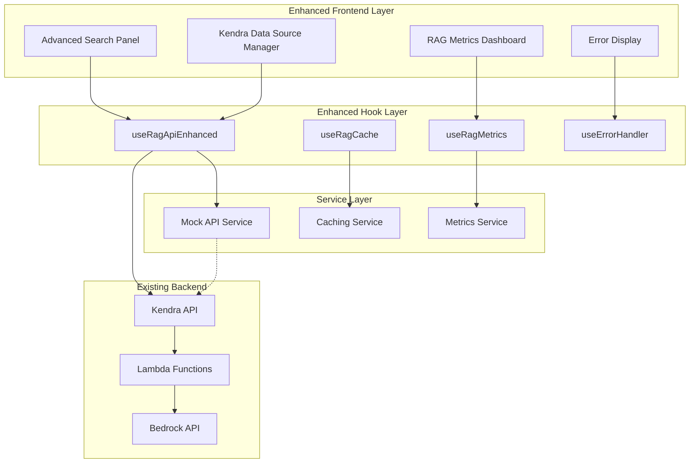

# Enhanced RAG Features 概要

## 🎯 はじめに

このドキュメントでは、Generative AI Use Cases (GenU) プロジェクトに追加された Enhanced RAG Features の概要について説明します。これらの機能により、既存のKendra RAGシステムがより高度で使いやすくなり、開発者とエンドユーザーの両方にとって価値のある機能を提供します。

## 📊 機能追加の背景

### 既存システムの課題
- 基本的な検索機能のみ
- パフォーマンス監視機能の不足
- 開発・テスト環境の不備
- エラーハンドリングの限定性
- ユーザビリティの改善余地

### Enhanced RAG Features で解決される課題
- **高度な検索体験**: ファセット検索、リアルタイム候補、ソート機能
- **運用監視**: パフォーマンスメトリクス、ダッシュボード機能
- **開発効率**: モックAPI、統合テスト環境、包括的テストスイート
- **エラー対応**: 詳細なエラーハンドリング、自動再試行機能
- **データ管理**: Kendraデータソースの監視・管理機能

## 🚀 主要機能一覧

### 1. Advanced Search Panel（高度な検索パネル）
**概要**: ユーザーがより精密で効率的な検索を行えるUIコンポーネント

**主要機能**:
- **ファセット検索**: ファイルタイプ、カテゴリ、作成者による絞り込み
- **リアルタイム検索候補**: 300msデバウンスによる応答性の高い候補表示
- **ソート機能**: 作成日、更新日、関連性による並び替え
- **フィルタリング**: 複数条件による高度な絞り込み

**技術的特徴**:
```typescript
// デバウンス機能による効率的な候補取得
const fetchSuggestions = useCallback(
  debounce(async (q: string) => {
    if (q.length > 2) {
      const suggestionsResult = await getSuggestions(q);
      setSuggestions(suggestionsResult);
    }
  }, 300),
  []
);
```

### 2. RAG Metrics Dashboard（パフォーマンス監視ダッシュボード）
**概要**: RAGシステムのパフォーマンスを可視化・監視するダッシュボード

**主要機能**:
- **リアルタイムメトリクス**: クエリ数、成功率、平均応答時間の表示
- **人気キーワード**: よく検索されるキーワードの分析
- **最適化率**: クエリ最適化の成功率追跡
- **展開可能UI**: コンパクトビューと詳細ビューの切り替え

**メトリクス例**:
```typescript
interface RAGPerformanceStats {
  totalQueries: number;                    // 総クエリ数
  averageProcessingTime: number;           // 平均処理時間(ms)
  averageDocumentScore: number;            // 平均文書スコア
  successRate: number;                     // 成功率(%)
  mostCommonQueries: string[];             // 人気クエリ
  queryOptimizationSuccessRate: number;    // 最適化成功率(%)
}
```

### 3. Kendra Data Source Manager（データソース管理）
**概要**: Amazon Kendraデータソースの状態監視と管理機能

**主要機能**:
- **データソース一覧**: 接続されたデータソースの表示
- **同期状況の監視**: 最終同期時刻、エラー状況の確認
- **手動同期実行**: データソースの即座な更新機能
- **統計情報表示**: 文書数、エラー回数などの詳細情報

**データソース情報**:
```typescript
interface DataSource {
  id: string;
  name: string;
  type: 'S3' | 'SharePoint' | 'OneDrive' | 'Confluence';
  status: 'ACTIVE' | 'SYNCING' | 'ERROR' | 'INACTIVE';
  lastSyncTime?: string;
  documentsCount?: number;
  errorMessage?: string;
}
```

### 4. Enhanced API System（拡張APIシステム）
**概要**: より柔軟で高性能なRAG API機能

**主要機能**:
- **Query API**: 高速検索（100トークン制限）
- **Retrieve API**: 詳細検索（200トークン制限）
- **Suggestions API**: リアルタイム検索候補
- **Faceted Search API**: ファセット検索機能

**API使用例**:
```typescript
const { queryForSearch, retrieveForRAG, getSuggestions } = useRagApiEnhanced();

// 高速検索
const quickResults = await queryForSearch('machine learning');

// 詳細検索（RAG用）
const detailedResults = await retrieveForRAG('machine learning concepts');

// 検索候補
const suggestions = await getSuggestions('machine');
```

### 5. Intelligent Caching System（インテリジェントキャッシュシステム）
**概要**: LRUアルゴリズムとTTLによる効率的なキャッシング

**主要機能**:
- **5分間のTTL**: 適切な鮮度を保つキャッシュ期間
- **LRU（Least Recently Used）**: メモリ効率的なキャッシュ管理
- **ヒット率追跡**: キャッシュパフォーマンスの監視
- **選択的キャッシュ**: 検索結果、候補、メトリクスの個別管理

**キャッシュ設定**:
```typescript
const cacheConfig = {
  defaultTTL: 5 * 60 * 1000,      // 5分
  maxSize: 100,                   // 最大アイテム数
  keyPrefix: 'rag_',              // キーのプレフィックス
  persistent: true                // localStorage永続化
};
```

### 6. Robust Error Handling（堅牢なエラーハンドリング）
**概要**: ユーザーフレンドリーで自動復旧機能を持つエラー処理システム

**主要機能**:
- **エラー分類**: ネットワーク、認証、レート制限、サーバーエラーの識別
- **自動再試行**: エラータイプに応じた適切な再試行戦略
- **カウントダウン表示**: 再試行までの残り時間表示
- **ユーザーガイダンス**: 具体的な対処方法の提示

**エラー処理例**:
```typescript
interface ParsedError {
  type: 'NETWORK_ERROR' | 'AUTH_ERROR' | 'RATE_LIMIT' | 'SERVER_ERROR';
  message: string;
  retryable: boolean;
  retryDelay?: number;        // 再試行までの遅延時間(ms)
  userAction?: string;        // ユーザーが取るべき行動
}
```

### 7. Mock API Service（開発・テスト用モックAPI）
**概要**: 実際のKendra APIを使わずに開発・テストができるモックサービス

**主要機能**:
- **リアルなレスポンス**: 実際のKendra APIと同じ形式のレスポンス
- **レスポンス時間調整**: 100-1000msの範囲でリアルな遅延をシミュレーション
- **エラーシミュレーション**: 様々なエラー状況の再現
- **設定可能**: エラー率、遅延時間の調整可能

**モック設定**:
```typescript
export const mockConfig = {
  responseDelay: { min: 100, max: 400 },    // レスポンス遅延範囲
  errorRate: 0.1,                           // 10%のエラー率
  customResponses: new Map(),               // カスタムレスポンス
  enableDetailedLogging: true               // 詳細ログ出力
};
```

### 8. Comprehensive Test Suite（包括的テストスイート）
**概要**: すべての機能を網羅する自動テストシステム

**テスト構成**:
- **単体テスト**: 各コンポーネント・フックの独立テスト
- **統合テスト**: コンポーネント間の連携テスト
- **パフォーマンステスト**: レスポンス時間・メモリ使用量測定
- **エラーハンドリングテスト**: 様々なエラー状況のテスト

**テスト実行結果例**:
```
✓ Advanced Search Panel - ファセット検索機能
✓ RAG Metrics Dashboard - メトリクス表示機能  
✓ Kendra Data Source Manager - 同期機能
✓ Error Display - 再試行カウントダウン機能
✓ Mock API Service - レスポンス時間シミュレーション
✓ Cache System - LRU動作確認
✓ Enhanced RAG Hooks - API統合機能
```

### 9. Enhanced RAG Tester（統合テストツール）
**概要**: 開発環境で利用できるインタラクティブなテストツール

**アクセス方法**: `http://localhost:3000/test-rag`（開発環境のみ）

**テスト項目**:
1. **Basic Query API Test** - 基本クエリAPIの動作確認
2. **Search Suggestions Test** - 検索候補機能のテスト
3. **Faceted Search Test** - ファセット検索のテスト
4. **Error Handling Test** - エラーハンドリングのテスト
5. **Caching System Test** - キャッシュシステムのテスト
6. **Performance Metrics Test** - パフォーマンス測定のテスト

## 🏗️ アーキテクチャ改善

### 既存アーキテクチャとの統合
Enhanced RAG Featuresは既存のKendra RAGアーキテクチャを拡張する形で実装されており、既存機能との互換性を保持しています。



### 機能フラグによる段階的展開
すべての新機能は環境変数による機能フラグで制御されており、必要に応じて個別に有効化/無効化できます。

```bash
# .env.local での設定例
VITE_APP_ENABLE_RAG_OPTIMIZATION=true      # RAG最適化機能
VITE_APP_ENABLE_ADVANCED_SEARCH=true       # 高度な検索パネル
VITE_APP_ENABLE_METRICS_DASHBOARD=true     # メトリクスダッシュボード
VITE_APP_ENABLE_DATA_SOURCE_MANAGER=true   # データソース管理
```

## 📈 期待される効果

### 1. ユーザー体験の向上
- **検索精度向上**: ファセット検索による精密な絞り込み
- **効率性向上**: リアルタイム候補による入力効率化
- **可視性向上**: パフォーマンスダッシュボードによる透明性

### 2. 開発効率の向上
- **テスト効率**: モックAPIによる独立したテスト環境
- **デバッグ効率**: 包括的なメトリクスと詳細なエラー情報
- **保守性向上**: 構造化されたコードとテストスイート

### 3. 運用品質の向上
- **監視機能**: リアルタイムパフォーマンス監視
- **障害対応**: 自動再試行とユーザーフレンドリーなエラー表示
- **データ管理**: Kendraデータソースの効率的な管理

### 4. システム信頼性の向上
- **キャッシング**: レスポンス時間の改善とAPI負荷軽減
- **エラーハンドリング**: グレースフルデグラデーション
- **テスト可能性**: 包括的なテストカバレッジ

## 🚀 導入方法

### ステップ1: 環境設定
```bash
cd /packages/web
cp .env.example .env.local
# 必要な環境変数を設定
```

### ステップ2: 依存関係インストール
```bash
npm install
```

### ステップ3: 開発サーバー起動
```bash
npm run dev
```

### ステップ4: 機能確認
- メインアプリケーション: `http://localhost:3000`
- テストUI: `http://localhost:3000/test-rag`

## 📚 関連ドキュメント

### 技術ドキュメント
- [Enhanced RAG Features Documentation](../enhanced-rag-features.md) - 詳細な技術仕様
- [Enhanced RAG Setup Guide](./ENHANCED_RAG_SETUP.md) - セットアップ手順
- [Enhanced RAG API Reference](../enhanced-rag-api-reference.md) - API仕様書

### 既存ドキュメント
- [Kendra RAG Architecture](../KENDRA_RAG_ARCHITECTURE.md) - 基盤アーキテクチャ
- [RAG Improvements Summary](../RAG_IMPROVEMENTS_SUMMARY.md) - 従来の改善履歴

## 🔮 今後の展開

### Phase 1: 基盤強化（完了）
- ✅ 高度な検索機能
- ✅ パフォーマンス監視
- ✅ テスト環境整備
- ✅ エラーハンドリング強化

### Phase 2: AI機能拡張（計画中）
- 🚧 セマンティック検索
- 🚧 文書間関係性分析
- 🚧 自動カテゴリ分類
- 🚧 クエリ意図理解

### Phase 3: 運用支援強化（構想中）
- 📋 A/Bテスト機能
- 📋 ユーザー行動分析
- 📋 パフォーマンス最適化提案
- 📋 自動アラート機能

## 🤝 コントリビューション

Enhanced RAG Featuresは継続的な改善を目指しています。以下の形でのコントリビューションを歓迎します：

### 開発への参加
- **機能提案**: 新機能のアイデアや改善提案
- **バグレポート**: 問題の報告と再現手順の提供
- **コードレビュー**: プルリクエストのレビューと改善提案
- **ドキュメント改善**: 説明の追加や誤りの修正

### フィードバック
- **使用感の報告**: 実際の使用体験に基づく感想
- **パフォーマンス情報**: 実環境での性能データ
- **機能要望**: 必要な機能や改善点の提案

### コントリビューション方法
```bash
# 1. リポジトリのフォーク
git fork https://github.com/aws-samples/generative-ai-use-cases

# 2. 機能ブランチの作成
git checkout -b feature/enhanced-rag-improvement

# 3. 変更の実装とテスト
npm run test
npm run type-check

# 4. プルリクエストの作成
git push origin feature/enhanced-rag-improvement
```

## 📞 サポート情報

### 技術サポート
- **GitHub Issues**: [プロジェクトのIssues](https://github.com/aws-samples/generative-ai-use-cases/issues)
- **ディスカッション**: [GitHub Discussions](https://github.com/aws-samples/generative-ai-use-cases/discussions)

### ドキュメント
- **公式ドキュメント**: [docs.aws.amazon.com](https://docs.aws.amazon.com/)
- **コミュニティ**: [AWS Developer Forums](https://forums.aws.amazon.com/)

### アップデート情報
- **リリースノート**: GitHubのReleasesページ
- **ブログ**: [AWS公式ブログ](https://aws.amazon.com/jp/blogs/)

---

Enhanced RAG Featuresは、GenUプロジェクトをより実用的で強力なRAGシステムに進化させる重要な機能追加です。これらの機能を活用して、より良いユーザー体験と開発効率を実現してください。