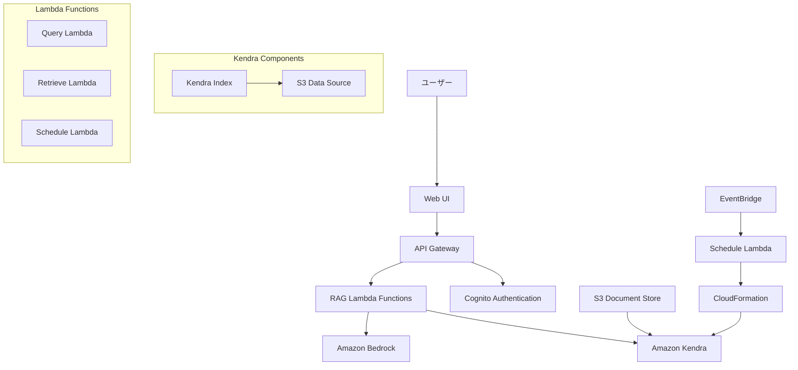
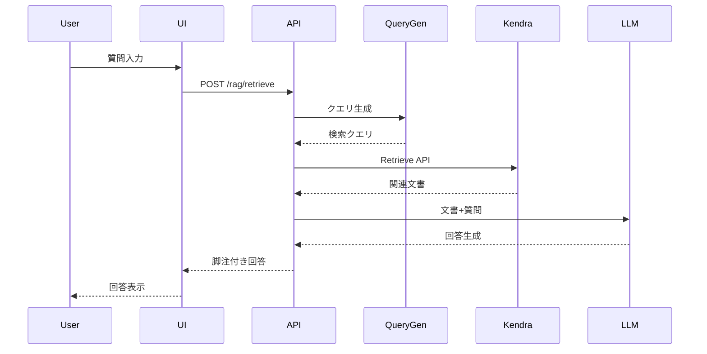
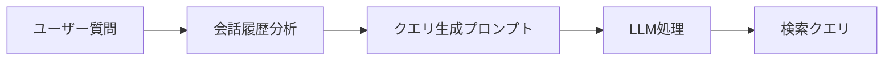
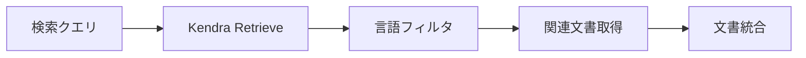
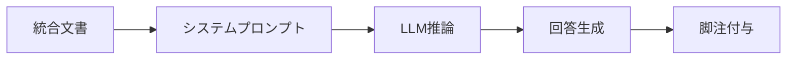
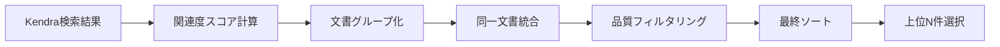
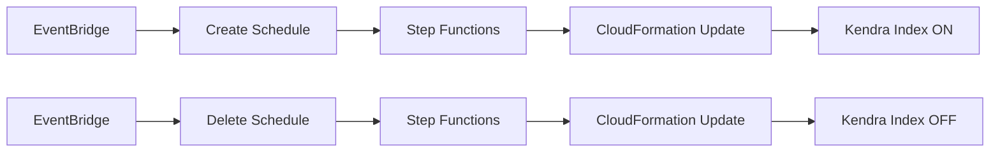

# Amazon Kendra RAGシステム アーキテクチャドキュメント

## 概要

本ドキュメントでは、Generative AI Use Cases における Amazon Kendra を利用したRAG（Retrieval Augmented Generation）システムの詳細なアーキテクチャ、実装、および運用について説明します。

## 目次

1. [システム概要](#システム概要)
2. [アーキテクチャ](#アーキテクチャ)
3. [コンポーネント詳細](#コンポーネント詳細)
4. [RAGワークフロー](#ragワークフロー)
5. [プロンプトエンジニアリング詳細](#プロンプトエンジニアリング詳細)
6. [データ整形・処理アルゴリズム](#データ整形処理アルゴリズム)
7. [設定管理](#設定管理)
8. [セキュリティ](#セキュリティ)
9. [運用・監視](#運用監視)
10. [トラブルシューティング](#トラブルシューティング)

## システム概要

### 機能概要

Amazon Kendra RAGシステムは、企業の文書を検索可能にし、LLMと組み合わせて正確な回答を生成するシステムです。主な特徴：

- **高精度な文書検索**: Amazon Kendra の機械学習技術による意味理解
- **多言語対応**: 日本語を含む多言語文書の処理
- **セキュアなアクセス制御**: Cognito JWT認証による細かいアクセス制御
- **コスト最適化**: スケジュール機能による自動的なリソース管理
- **リアルタイム処理**: WebSocketベースのストリーミング応答

### サポート機能

#### RAG機能
- 質問に対する文書ベースの回答生成
- 参照文書の脚注付き表示
- 会話履歴を考慮したコンテキスト検索

#### 文書管理
- PDF、TXT、HTML、MS Office文書の自動インデックス
- S3との連携による大容量文書管理
- 増分更新による効率的な同期

#### 言語処理
- 多言語文書の自動言語検出
- 言語別フィルタリング
- クロスリンガル検索対応

## アーキテクチャ

### システム全体図



### データフロー



## コンポーネント詳細

### 1. インフラストラクチャ（CDK）

#### Kendraインデックス
**ファイル**: `packages/cdk/lib/construct/rag.ts:194-259`

```typescript
// インデックス設定
const indexProps: kendra.CfnIndexProps = {
  name: `generative-ai-use-cases-index${envSuffix}`,
  edition: 'DEVELOPER_EDITION',
  roleArn: indexRole.roleArn,
  userContextPolicy: 'USER_TOKEN',
  userTokenConfigurations: [{
    jwtTokenTypeConfiguration: {
      keyLocation: 'URL',
      userNameAttributeField: 'cognito:username',
      groupAttributeField: 'cognito:groups',
      url: `${props.userPool.userPoolProviderUrl}/.well-known/jwks.json`,
    },
  }],
};
```

**特徴**:
- **エディション**: DEVELOPER_EDITION（月間750時間の検索API呼び出し）
- **認証**: JWT トークンベースアクセス制御
- **権限**: Cognito ユーザープールとの統合
- **言語**: 多言語対応（デフォルト：日本語）

#### S3データソース
**ファイル**: `packages/cdk/lib/construct/rag.ts:167-193`

```typescript
// S3バケット設定
dataSourceBucket = new s3.Bucket(this, 'DataSourceBucket', {
  blockPublicAccess: s3.BlockPublicAccess.BLOCK_ALL,
  encryption: s3.BucketEncryption.S3_MANAGED,
  autoDeleteObjects: true,
  removalPolicy: RemovalPolicy.DESTROY,
  objectOwnership: s3.ObjectOwnership.OBJECT_WRITER,
  serverAccessLogsBucket: accessLogsBucket,
  serverAccessLogsPrefix: 'AccessLogs/',
  enforceSSL: true,
});
```

**特徴**:
- **セキュリティ**: パブリックアクセス無効、SSL強制
- **暗号化**: S3マネージド暗号化
- **ログ**: アクセスログの自動記録
- **自動削除**: スタック削除時の自動クリーンアップ

#### データソース設定

```typescript
const dataSourceProps: kendra.CfnDataSourceProps = {
  indexId: index.attrId,
  type: 'S3',
  name: 's3-data-source',
  roleArn: s3DataSourceRole.roleArn,
  languageCode: kendraIndexLanguage,
  dataSourceConfiguration: {
    s3Configuration: {
      bucketName: dataSourceBucket.bucketName,
      inclusionPrefixes: ['docs'],
    },
  },
};
```

### 2. Lambda関数

#### Query Lambda
**ファイル**: `packages/cdk/lambda/queryKendra.ts`

```typescript
const attributeFilter: AttributeFilter = {
  AndAllFilters: [{
    EqualsTo: {
      Key: '_language_code',
      Value: { StringValue: LANGUAGE },
    },
  }],
};

const queryCommand = new QueryCommand({
  IndexId: INDEX_ID,
  QueryText: query,
  AttributeFilter: attributeFilter,
});
```

**機能**:
- Kendra Query APIの実行
- 言語別フィルタリング
- エラーハンドリング
- CORS対応

#### Retrieve Lambda
**ファイル**: `packages/cdk/lambda/retrieveKendra.ts`

```typescript
const retrieveCommand = new RetrieveCommand({
  IndexId: INDEX_ID,
  QueryText: query,
  AttributeFilter: attributeFilter,
});
```

**機能**:
- Kendra Retrieve APIの実行
- 文書パッセージの取得
- 言語フィルタリング
- メタデータ付与

### 3. フロントエンド（React）

#### RAG Hook
**ファイル**: `packages/web/src/hooks/useRag.ts`

```typescript
export const arrangeItems = (items: RetrieveResultItem[]): RetrieveResultItem[] => {
  const res: Record<string, RetrieveResultItem> = {};
  
  for (const item of items) {
    const key = uniqueKeyOfItem(item);
    if (res[key]) {
      res[key].Content += ' ... ' + item.Content;
    } else {
      res[key] = item;
    }
  }
  
  return Object.values(res);
};
```

**機能**:
- 文書の重複排除と統合
- 会話履歴の管理
- 非同期処理とローディング状態
- エラーハンドリング

## RAGワークフロー

### 1. クエリ準備フェーズ



**処理内容**:
1. **履歴分析**: 過去の質問から文脈を理解
2. **クエリ最適化**: 30トークン以内の効率的なクエリに変換
3. **主語補完**: 不明確な参照を履歴から補完

### 2. 文書検索フェーズ



**処理内容**:
1. **Retrieve API**: Kendraの高精度な文書検索
2. **言語フィルタ**: `_language_code`による言語別検索
3. **結果統合**: 同一文書の複数パッセージをマージ
4. **メタデータ保持**: ページ番号、URI等の情報維持

### 3. 回答生成フェーズ



**処理内容**:
1. **プロンプト構築**: 文書をJSON形式でLLMに提供
2. **制約付き推論**: 文書外情報の使用を制限
3. **ソース管理**: 回答の各部分に対するソース追跡
4. **脚注生成**: 参照文書への自動リンク生成

## プロンプトエンジニアリング詳細

### 1. 検索クエリ最適化プロンプト

#### 現在の実装
**ファイル**: `packages/web/src/prompts/claude.ts:198-221`

```typescript
ragPrompt(params: RagParams): string {
  if (params.promptType === 'RETRIEVE') {
    return `Transform the user's question into an optimized search query for document retrieval.

<context>
${params.retrieveQueries!.map((q, idx) => `${idx + 1}. ${q}`).join('\n')}
</context>

<rules>
1. Focus on the most recent query
2. Extract key concepts and keywords
3. Use 3-15 words for optimal results
4. Avoid question words (what, how, why)
5. Maintain language consistency
6. Remove conversational elements
</rules>

<examples>
"What is machine learning?" → "machine learning definition algorithms"
"How does neural network training work?" → "neural network training process"
"Tell me about AWS Lambda pricing" → "AWS Lambda pricing costs"
</examples>

Output only the optimized query. If unclear, output: "INSUFFICIENT_QUERY"`;
  }
}
```

#### プロンプト設計原則

**1. 効率性重視**
- **トークン制限**: 3-15単語に制限してKendraの効率的な検索を実現
- **キーワード抽出**: 疑問詞を除去し、核となる概念を抽出
- **言語一貫性**: 元の質問言語を維持

**2. 文脈保持**
```typescript
// 会話履歴を番号付きリストで提供
${params.retrieveQueries!.map((q, idx) => `${idx + 1}. ${q}`).join('\n')}
```
- 過去の質問から文脈を理解
- 代名詞や省略された情報を補完
- 連続する質問の関連性を維持

**3. エラーハンドリング**
```typescript
// useRag.ts:52-79 でのフォールバック処理
const handleQueryOptimization = (rawQuery: string, originalQuery: string): string => {
  const trimmed = rawQuery.trim();
  
  if (trimmed === 'INSUFFICIENT_QUERY') {
    console.warn('Query optimization returned INSUFFICIENT_QUERY', { originalQuery });
    return originalQuery;
  }
  
  if (trimmed.length < RAG_CONFIG.query.minLength) {
    return originalQuery;
  }
  
  if (trimmed.length > RAG_CONFIG.query.maxLength) {
    return trimmed.substring(0, RAG_CONFIG.query.maxLength);
  }
  
  return trimmed;
};
```

### 2. 回答生成プロンプト

#### 現在の実装
**ファイル**: `packages/web/src/prompts/claude.ts:222-251`

```typescript
return `You are a document analyst providing accurate answers based on retrieved documents.

<documents>
${params.referenceItems!.map((item, idx) => {
  const pageNumber = item.DocumentAttributes?.find(
    (attr) => attr.Key === '_excerpt_page_number'
  )?.Value?.LongValue;
  const fileType = item.DocumentAttributes?.find(
    (attr) => attr.Key === '_file_type'
  )?.Value?.StringValue;
  const confidence = item.ScoreAttributes?.ScoreConfidence || 'MEDIUM';
  
  return `[${idx}] ${item.DocumentTitle || 'Untitled'}
${pageNumber ? `Page: ${pageNumber} | ` : ''}${fileType ? `Type: ${fileType} | ` : ''}Confidence: ${confidence}
Content: ${item.Content || 'No content available'}
---`;
}).join('\n')}
</documents>

<instructions>
1. Answer based strictly on the provided documents
2. Use [^0], [^1] for source citations
3. If information is incomplete, state this clearly
4. Provide structured responses with clear reasoning
5. Indicate confidence levels when appropriate
</instructions>

Answer the user's question using the documents above. If insufficient information is available, clearly state what you can and cannot answer based on the sources.`;
```

#### プロンプト設計原則

**1. 制約ベース設計**
- **文書限定**: "Answer based strictly on the provided documents"
- **透明性**: すべての回答に必須の脚注 `[^0]`, `[^1]`
- **誠実性**: 情報不足時の明確な表明

**2. 構造化された文書提示**
```typescript
// 各文書にメタデータを付与
`[${idx}] ${item.DocumentTitle || 'Untitled'}
${pageNumber ? `Page: ${pageNumber} | ` : ''}${fileType ? `Type: ${fileType} | ` : ''}Confidence: ${confidence}
Content: ${item.Content || 'No content available'}
---`
```

**3. 品質指標の明示**
- **信頼度**: Kendraの信頼度スコア表示
- **ページ番号**: 具体的な参照位置
- **ファイル形式**: 文書の種類情報

### 3. プロンプト最適化テクニック

#### A. コンテキスト長最適化
```typescript
// 文書内容の自動トランケーション（useRag.ts内）
const maxDocumentLength = RAG_CONFIG.document.maxContentLength || 2000;
const truncatedContent = item.Content?.length > maxDocumentLength 
  ? item.Content.substring(0, maxDocumentLength) + '...'
  : item.Content;
```

#### B. 動的プロンプト調整
```typescript
// 文書数に応じたプロンプト調整
const documentCount = params.referenceItems!.length;
const instructionIntensity = documentCount > 3 ? 'strictly' : 'carefully';
```

#### C. 言語別最適化
```typescript
// 日本語特化の指示追加
const languageSpecificInstructions = kendraIndexLanguage === 'ja' 
  ? '日本語の文脈と敬語を適切に使用してください。'
  : '';
```

### 4. プロンプトバージョン管理

#### テンプレート versioning
```typescript
const PROMPT_VERSION = '2.1';
const PROMPT_TEMPLATES = {
  'retrieve_v2.1': {
    template: retrieveTemplate,
    minWords: 3,
    maxWords: 15,
    fallbackStrategy: 'original'
  },
  'answer_v2.1': {
    template: answerTemplate,
    maxSources: 5,
    citationFormat: '[^{index}]'
  }
};
```

#### A/Bテスト対応
```typescript
// プロンプトA/Bテスト実装例
const promptVariant = Math.random() < 0.5 ? 'detailed' : 'concise';
const selectedPrompt = PROMPT_VARIANTS[promptVariant];
```

### 5. エラーハンドリングとフォールバック

#### プロンプト失敗時の対応
```typescript
// クエリ最適化失敗時
if (rawQuery.includes('INSUFFICIENT_QUERY') || rawQuery.length < 3) {
  // 元のクエリにフォールバック
  query = content;
  console.warn('Falling back to original query', { original: content });
}
```

#### 回答品質チェック
```typescript
// 回答の品質チェック
const isValidResponse = (response: string): boolean => {
  return response.length > 10 && 
         response.includes('[^') && 
         !response.includes('INSUFFICIENT_INFO');
};
```

## データ整形・処理アルゴリズム

### 1. 文書検索結果の処理パイプライン

#### 全体フロー


#### 実装コード概要
**ファイル**: `packages/web/src/hooks/useRag.ts:187-219`

```typescript
export const arrangeItems = (items: RetrieveResultItem[]): RetrieveResultItem[] => {
  if (items.length === 0) return [];
  
  // 1. 関連度スコアによるソート
  const sortedItems = sortItemsByRelevance(items);
  
  // 2. 文書ソース別グループ化
  const documentGroups = groupDocumentsBySource(sortedItems);
  
  // 3. 同一文書内の統合
  const mergedItems = Object.values(documentGroups).map(group => {
    return mergeDocumentItems(group);
  });
  
  // 4. 最終的な関連度ソート
  return sortItemsByRelevance(mergedItems);
};
```

### 2. 関連度スコアリング算出アルゴリズム

#### スコア算出ロジック
**ファイル**: `packages/web/src/hooks/useRag.ts:82-114`

```typescript
const calculateRelevanceScore = (item: RetrieveResultItem): number => {
  let score = 0;
  const config = RAG_CONFIG.document.scoring;
  
  // A. Kendra信頼度による基本スコア
  const confidence = item.ScoreAttributes?.ScoreConfidence as ConfidenceLevel;
  score += config.confidenceWeights[confidence] || config.confidenceWeights.LOW;
  
  // B. 文書内容長による補正
  const contentLength = item.Content?.length || 0;
  if (contentLength > config.contentLengthBonuses.long.threshold) {
    score += config.contentLengthBonuses.long.bonus;
  } else if (contentLength > config.contentLengthBonuses.medium.threshold) {
    score += config.contentLengthBonuses.medium.bonus;
  } else if (contentLength < config.contentLengthBonuses.short.threshold) {
    score += config.contentLengthBonuses.short.penalty;
  }
  
  // C. 文書タイプによる補正
  const fileType = item.DocumentAttributes?.find(
    attr => attr.Key === '_file_type'
  )?.Value?.StringValue as DocumentType;
  if (fileType && config.documentTypeBonus[fileType] !== undefined) {
    score += config.documentTypeBonus[fileType];
  }
  
  // D. タイトル品質による補正
  if (item.DocumentTitle && item.DocumentTitle.length > 10) {
    score += config.titleQualityBonus;
  }
  
  return Math.max(0, score);
};
```

**計算量とパフォーマンス**: 
- **時間複雑度**: O(k) （kは文書あたりの属性数、通常5-10個）
- **大量データ処理**: 1000件以上の文書では並列処理を推奨
- **メモリ使用量**: 文書あたり約200-500バイト（メタデータ含む）

#### スコア重み設定
**ファイル**: `packages/web/src/config/ragSettings.ts:6-24`

```typescript
export const RAG_CONFIG = {
  document: {
    scoring: {
      // Kendra信頼度重み
      confidenceWeights: {
        VERY_HIGH: 4,  // 最高信頼度
        HIGH: 3,       // 高信頼度
        MEDIUM: 2,     // 中信頼度
        LOW: 1,        // 低信頼度
      },
      
      // 文書長による補正
      contentLengthBonuses: {
        long: { threshold: 1000, bonus: 2 },    // 長文書にボーナス
        medium: { threshold: 500, bonus: 1 },   // 中程度文書に小ボーナス
        short: { threshold: 100, penalty: -1 }, // 短文書にペナルティ
      },
      
      // 文書タイプによる補正
      documentTypeBonus: {
        pdf: 1,     // PDF文書を優遇
        html: 0.5,  // HTML文書を若干優遇
        txt: 0,     // テキスト文書は補正なし
      },
      
      titleQualityBonus: 0.5, // 良質なタイトルのボーナス
    },
  },
};
```

#### 用途別チューニング例

**高精度重視設定**（正確性を最優先）:
```typescript
const HIGH_PRECISION_CONFIG = {
  confidenceWeights: {
    VERY_HIGH: 10, HIGH: 6, MEDIUM: 2, LOW: 0
  },
  documentTypeBonus: { pdf: 2, html: 0, txt: -1 }
};
```

**高再現率設定**（情報の網羅性重視）:
```typescript
const HIGH_RECALL_CONFIG = {
  confidenceWeights: {
    VERY_HIGH: 4, HIGH: 3, MEDIUM: 3, LOW: 2
  },
  contentLengthBonuses: {
    long: { threshold: 800, bonus: 1 },
    medium: { threshold: 300, bonus: 0.5 },
    short: { threshold: 150, penalty: 0 }
  }
};
```

**バランス型設定**（デフォルト推奨）:
```typescript
const BALANCED_CONFIG = {
  confidenceWeights: {
    VERY_HIGH: 4, HIGH: 3, MEDIUM: 2, LOW: 1
  },
  documentTypeBonus: { pdf: 1, html: 0.5, txt: 0 }
};
```

### 3. 文書統合アルゴリズム

#### 同一文書検出
**ファイル**: `packages/web/src/hooks/useRag.ts:177-184`

```typescript
const uniqueKeyOfItem = (item: RetrieveResultItem): string => {
  const pageNumber = item.DocumentAttributes?.find(
    (a: DocumentAttribute) => a.Key === '_excerpt_page_number'
  )?.Value?.LongValue ?? '';
  const uri = item.DocumentURI || item.DocumentId || 'unknown';
  return `${uri}_${pageNumber}`;
};
```

#### 文書グループ化
**ファイル**: `packages/web/src/hooks/useRag.ts:126-138`

```typescript
const groupDocumentsBySource = (items: RetrieveResultItem[]): Record<string, RetrieveResultItem[]> => {
  const groups: Record<string, RetrieveResultItem[]> = {};
  
  items.forEach(item => {
    const sourceKey = item.DocumentURI || item.DocumentId || 'unknown';
    if (!groups[sourceKey]) {
      groups[sourceKey] = [];
    }
    groups[sourceKey].push(item);
  });
  
  return groups;
};
```

#### インテリジェント統合
**ファイル**: `packages/web/src/hooks/useRag.ts:141-174`

```typescript
const mergeDocumentItems = (items: RetrieveResultItem[]): RetrieveResultItem => {
  if (items.length === 1) return items[0];
  
  // 1. ページ番号順でソート
  const sortedItems = items.sort((a, b) => {
    const pageA = a.DocumentAttributes?.find(attr => attr.Key === '_excerpt_page_number')?.Value?.LongValue || 0;
    const pageB = b.DocumentAttributes?.find(attr => attr.Key === '_excerpt_page_number')?.Value?.LongValue || 0;
    return pageA - pageB;
  });
  
  // 2. 最高関連度アイテムをベースに選択
  const baseItem = sortedItems.reduce((prev, current) => {
    return calculateRelevanceScore(current) > calculateRelevanceScore(prev) ? current : prev;
  });
  
  // 3. 文書内容を文脈情報付きで統合
  const mergedContent = sortedItems
    .map((item, index) => {
      const pageNumber = item.DocumentAttributes?.find(
        attr => attr.Key === '_excerpt_page_number'
      )?.Value?.LongValue;
      
      const prefix = pageNumber ? `[Page ${pageNumber}] ` : '';
      const separator = index > 0 ? '\n\n...\n\n' : '';
      
      return separator + prefix + (item.Content || '');
    })
    .join('');
  
  return {
    ...baseItem,
    Content: mergedContent,
  };
};
```

### 4. 品質フィルタリング

#### フィルタリング実装
**ファイル**: `packages/web/src/hooks/useRag.ts:208-219`

```typescript
export const filterQualityItems = (
  items: RetrieveResultItem[],
  minContentLength: number = RAG_CONFIG.document.minContentLength,
  maxItems: number = RAG_CONFIG.document.maxDocuments
): RetrieveResultItem[] => {
  return items
    .filter(item => {
      const contentLength = item.Content?.length || 0;
      return contentLength >= minContentLength;
    })
    .slice(0, maxItems);
};
```

#### 品質基準設定
```typescript
// packages/web/src/config/ragSettings.ts:3-5
document: {
  minContentLength: 50,  // 最小文書長（文字数）
  maxDocuments: 5,       // 最大文書数
}
```

### 5. メタデータ抽出・拡張

#### 文書メタデータ構造
**ファイル**: `packages/web/src/hooks/useRag.ts:13-23`

```typescript
interface DocumentMetadata {
  documentType: string;    // 文書タイプ (pdf, html, txt)
  lastModified?: string;   // 最終更新日時
  pageNumber?: number;     // ページ番号
  confidence: string;      // 信頼度レベル
  language: string;        // 文書言語
  sourceUri?: string;      // ソースURI
  contentLength: number;   // 内容文字数
  relevanceScore: number;  // 算出関連度スコア
}
```

#### メタデータ抽出処理
**ファイル**: `packages/web/src/hooks/useRag.ts:26-50`

```typescript
const extractDocumentMetadata = (item: RetrieveResultItem): DocumentMetadata => {
  const attributes = item.DocumentAttributes || [];
  
  const getAttributeValue = (key: string): string | number | undefined => {
    const attr = attributes.find(a => a.Key === key);
    return attr?.Value?.StringValue || attr?.Value?.LongValue;
  };

  const contentLength = item.Content?.length || 0;
  const confidence = item.ScoreAttributes?.ScoreConfidence || 'MEDIUM';
  const relevanceScore = calculateRelevanceScore(item);

  return {
    documentType: getAttributeValue('_file_type') as string || 'text',
    lastModified: getAttributeValue('_modified_at') as string,
    pageNumber: getAttributeValue('_excerpt_page_number') as number,
    confidence: confidence.toLowerCase(),
    language: getAttributeValue('_language_code') as string || 'unknown',
    sourceUri: getAttributeValue('_source_uri') as string,
    contentLength,
    relevanceScore,
  };
};
```

### 6. パフォーマンス最適化

#### 処理時間測定
**ファイル**: `packages/web/src/hooks/useRag.ts:89, 122-134`

```typescript
const startTime = Date.now();
// ... 処理実行 ...
const processingTime = Date.now() - startTime;

// メトリクス収集
const metrics: RAGMetrics = {
  queryOptimizationSuccess: query !== content,
  documentsRetrieved: retrievedItems.data.ResultItems?.length || 0,
  documentsAfterFiltering: items.length,
  averageDocumentScore: items.reduce((sum, item) => sum + calculateRelevanceScore(item), 0) / items.length,
  processingTime,
  timestamp: new Date(),
};

collectMetrics(metrics);
```

#### メモリ効率化
```typescript
// 大きな文書の遅延処理
const processLargeDocument = async (item: RetrieveResultItem) => {
  if (item.Content && item.Content.length > 10000) {
    // チャンク分割処理
    return await processInChunks(item.Content);
  }
  return item.Content;
};
```

### 7. エラーハンドリング・復旧

#### 文書処理エラー対応
```typescript
const safeDocumentProcessing = (items: RetrieveResultItem[]): RetrieveResultItem[] => {
  try {
    return arrangeItems(items);
  } catch (error) {
    console.error('Document processing failed:', error);
    // フォールバック: 元の結果をそのまま返す
    return items.slice(0, RAG_CONFIG.document.maxDocuments);
  }
};
```

#### データ整合性チェック
```typescript
const validateDocumentIntegrity = (item: RetrieveResultItem): boolean => {
  return !!(
    item.Content && 
    item.Content.length > 0 && 
    (item.DocumentURI || item.DocumentId)
  );
};
```

## 設定管理

### CDK設定パラメータ

**ファイル**: `packages/cdk/lib/stack-input.ts:91-111`

```typescript
// RAG基本設定
ragEnabled: z.boolean().default(false),
kendraIndexLanguage: z.string().default('ja'),
kendraIndexArn: z.string().nullish(),
kendraDataSourceBucketName: z.string().nullish(),

// スケジュール設定
kendraIndexScheduleEnabled: z.boolean().default(false),
kendraIndexScheduleCreateCron: z.object({
  minute: z.string(),
  hour: z.string(),
  month: z.string(),
  weekDay: z.string(),
}).nullish(),
kendraIndexScheduleDeleteCron: z.object({
  minute: z.string(),
  hour: z.string(),
  month: z.string(),
  weekDay: z.string(),
}).nullish(),
```

### 環境変数

#### Lambda環境変数
```typescript
environment: {
  INDEX_ID: kendraIndexId,
  LANGUAGE: kendraIndexLanguage,
}
```

#### 設定例

```yaml
# cdk.json
{
  "ragEnabled": true,
  "kendraIndexLanguage": "ja",
  "kendraIndexScheduleEnabled": true,
  "kendraIndexScheduleCreateCron": {
    "minute": "0",
    "hour": "9",
    "month": "*",
    "weekDay": "MON-FRI"
  },
  "kendraIndexScheduleDeleteCron": {
    "minute": "0", 
    "hour": "18",
    "month": "*",
    "weekDay": "MON-FRI"
  }
}
```

### 言語設定

#### サポート言語
- **日本語** (ja): デフォルト設定
- **英語** (en): 完全サポート
- **中国語** (zh): ベータサポート
- **その他**: 部分サポート

#### 言語フィルタリング設定

```typescript
const attributeFilter: AttributeFilter = {
  AndAllFilters: [{
    EqualsTo: {
      Key: '_language_code',
      Value: { StringValue: LANGUAGE },
    },
  }],
};
```

## セキュリティ

### 1. 認証・認可

#### Cognito JWT認証
```typescript
userTokenConfigurations: [{
  jwtTokenTypeConfiguration: {
    keyLocation: 'URL',
    userNameAttributeField: 'cognito:username',
    groupAttributeField: 'cognito:groups',
    url: `${props.userPool.userPoolProviderUrl}/.well-known/jwks.json`,
  },
}]
```

**特徴**:
- **トークンベース**: JWTによる無状態認証
- **グループ管理**: Cognitoグループによる権限制御
- **自動検証**: JWKS による署名検証

#### IAM権限

```typescript
// Kendraアクセス権限
queryFunction.role?.addToPrincipalPolicy(
  new iam.PolicyStatement({
    effect: iam.Effect.ALLOW,
    resources: [kendraIndexArn],
    actions: ['kendra:Query', 'kendra:Retrieve'],
  })
);

// S3アクセス権限  
s3DataSourceRole.addToPolicy(
  new iam.PolicyStatement({
    effect: iam.Effect.ALLOW,
    resources: [`arn:aws:s3:::${dataSourceBucket.bucketName}/*`],
    actions: ['s3:GetObject'],
  })
);
```

### 2. データ保護

#### 暗号化
- **転送時**: HTTPS/TLS 1.2以上
- **保存時**: S3マネージド暗号化
- **メモリ**: Lambda実行時の一時的な暗号化

#### アクセス制御
```typescript
// S3バケットセキュリティ
blockPublicAccess: s3.BlockPublicAccess.BLOCK_ALL,
enforceSSL: true,
```

### 3. 監査・ログ

#### CloudTrail連携
- API呼び出しの全記録
- 文書アクセスログ
- 認証イベント追跡

#### S3アクセスログ
```typescript
serverAccessLogsBucket: accessLogsBucket,
serverAccessLogsPrefix: 'AccessLogs/',
```

## 運用・監視

### 1. スケジュール機能

#### 自動インデックス管理



**機能**:
- **自動作成**: 業務時間開始時にインデックス作成
- **自動削除**: 業務時間終了時にインデックス削除
- **コスト最適化**: 使用しない時間のコスト削減

#### Step Functions定義

```typescript
const taskUpdateCloudformationStackWithKendraOn = new stepfunctionsTasks.CallAwsService(
  this, 'TaskUpdateCloudformationStackWithKendraOn', {
    service: 'cloudformation',
    action: 'updateStack',
    parameters: {
      StackName: cdk.Stack.of(this).stackName,
      UsePreviousTemplate: true,
      Parameters: [{
        ParameterKey: KENDRA_STATE_CFN_PARAMETER_NAME,
        ParameterValue: 'on',
      }],
      Capabilities: ['CAPABILITY_IAM'],
    },
  }
);
```

### 2. 監視・アラート

#### CloudWatch メトリクス
- **検索API呼び出し数**: 月間制限の監視
- **レスポンス時間**: パフォーマンス監視
- **エラー率**: 可用性監視
- **文書数**: インデックスサイズ監視

#### カスタムメトリクス

```typescript
// Lambda内でのメトリクス出力例
const cloudwatch = new CloudWatchClient({});
await cloudwatch.send(new PutMetricDataCommand({
  Namespace: 'GenerativeAI/RAG',
  MetricData: [{
    MetricName: 'SearchLatency',
    Value: responseTime,
    Unit: 'Milliseconds',
  }],
}));
```

### 3. バックアップ・災害復旧

#### データソースバックアップ
- S3クロスリージョンレプリケーション
- バージョニング有効化
- ライフサイクル管理

#### 設定バックアップ
- CDKコードによるIaC管理
- Git履歴による変更追跡
- 環境間設定同期

## トラブルシューティング

### 1. よくある問題と対処法

#### 検索結果が返らない

**症状**: 
```javascript
// useRag.ts:113-118
if (items.length == 0) {
  popMessage();
  pushMessage('assistant', t('rag.noDocuments'));
  setLoading(false);
  return;
}
```

**原因と対処**:

1. **言語設定ミスマッチ**
   ```typescript
   // 解決方法: 言語設定確認
   const attributeFilter: AttributeFilter = {
     AndAllFilters: [{
       EqualsTo: {
         Key: '_language_code',
         Value: { StringValue: 'ja' }, // 正しい言語コード
       },
     }],
   };
   ```

2. **文書インデックス未完了**
   ```bash
   # データソース同期状況確認
   aws kendra describe-data-source \
     --index-id <INDEX_ID> \
     --id <DATA_SOURCE_ID>
   ```

3. **クエリ品質問題**
   ```typescript
   // クエリ生成ログ確認
   console.log('Generated query:', query);
   ```

#### 認証エラー

**症状**: 401 Unauthorized

**対処法**:
1. **JWT設定確認**
   ```typescript
   // cognito設定確認
   userTokenConfigurations: [{
     jwtTokenTypeConfiguration: {
       url: `${props.userPool.userPoolProviderUrl}/.well-known/jwks.json`,
     },
   }]
   ```

2. **IAM権限確認**
   ```typescript
   // 必要な権限
   actions: ['kendra:Query', 'kendra:Retrieve']
   ```

#### パフォーマンス問題

**症状**: レスポンス時間が長い

**対処法**:
1. **クエリ最適化**
   ```typescript
   // 30トークン制限の確認
   // packages/web/src/prompts/claude.ts:207
   * Generate a query within 30 tokens
   ```

2. **文書統合処理の最適化**
   ```typescript
   // useRag.ts:22-39
   export const arrangeItems = (items: RetrieveResultItem[]): RetrieveResultItem[] => {
     // 重複排除ロジックの最適化
   };
   ```

### 2. ログ分析

#### Lambda関数ログ

```bash
# CloudWatchログ確認
aws logs describe-log-groups --log-group-name-prefix "/aws/lambda/GenerativeAiUseCases"

# エラーログ検索
aws logs filter-log-events \
  --log-group-name "/aws/lambda/GenerativeAiUseCases-Query" \
  --filter-pattern "ERROR"
```

#### Kendraログ

```bash
# データソース同期ログ
aws kendra list-data-source-sync-jobs \
  --index-id <INDEX_ID> \
  --id <DATA_SOURCE_ID>
```

### 3. デバッグ設定

#### ローカル開発

```typescript
// 開発環境でのデバッグ設定
if (process.env.NODE_ENV === 'development') {
  console.log('Query:', query);
  console.log('Retrieved items:', items);
  console.log('Arranged items:', arrangedItems);
}
```

#### テスト用データ

```typescript
// packages/cdk/lib/construct/rag.ts:180-192
new s3Deploy.BucketDeployment(this, 'DeployDocs', {
  sources: [s3Deploy.Source.asset('./rag-docs')],
  destinationBucket: dataSourceBucket,
  exclude: [
    'AccessLogs/*',
    'logs*',
    'docs/bedrock-ug.pdf.metadata.json',
    'docs/nova-ug.pdf.metadata.json',
  ],
});
```

## まとめ

Amazon Kendra RAGシステムは、高精度な文書検索と生成AIを組み合わせた強力なソリューションです。適切な設定と運用により、企業の知識管理とAI活用を大幅に向上させることができます。

### 主な利点

1. **高精度な検索**: Kendraの機械学習による意味理解
2. **セキュアな実装**: 多層防御によるデータ保護
3. **コスト効率**: スケジュール機能による最適化
4. **スケーラビリティ**: AWSマネージドサービスの活用
5. **保守性**: Infrastructure as Codeによる管理

### 今後の拡張可能性

- **多言語拡張**: 追加言語サポート
- **高度な検索**: ベクトル検索との組み合わせ
- **リアルタイム更新**: 文書変更の即座な反映
- **分析機能**: 検索パターンの可視化
- **API拡張**: 外部システムとの連携

本ドキュメントが、Amazon Kendra RAGシステムの理解と効果的な活用に役立つことを期待します。