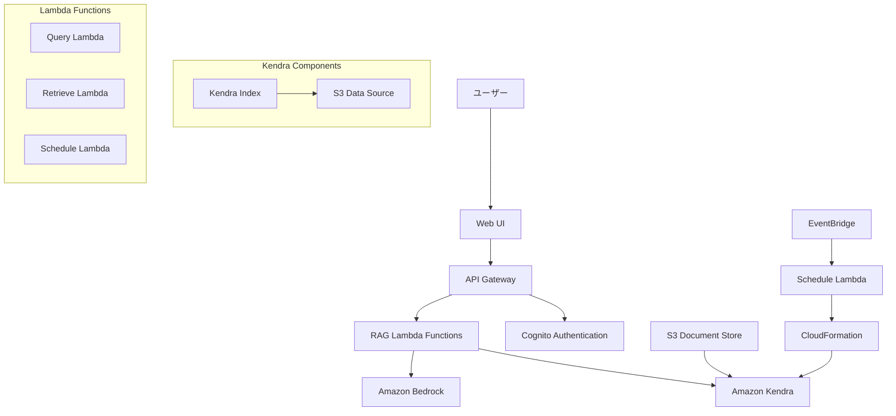
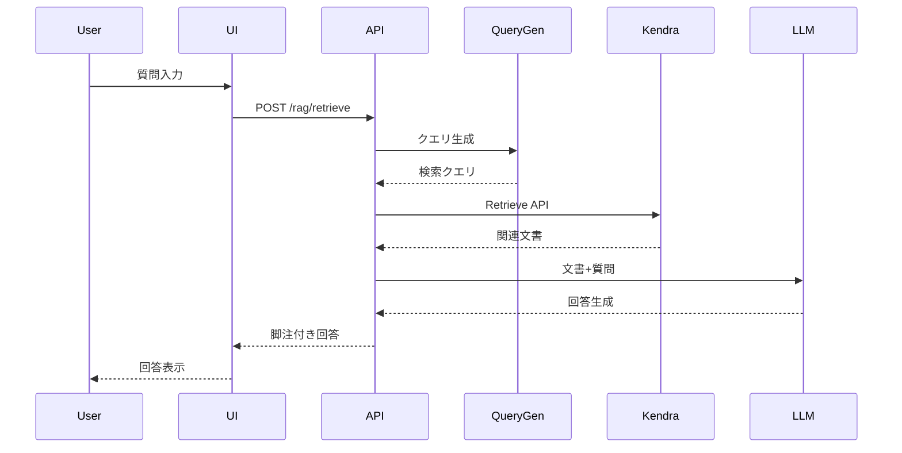
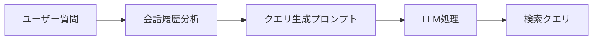
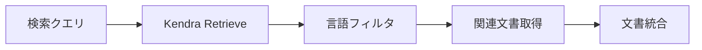
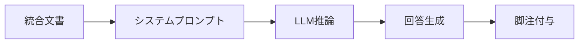
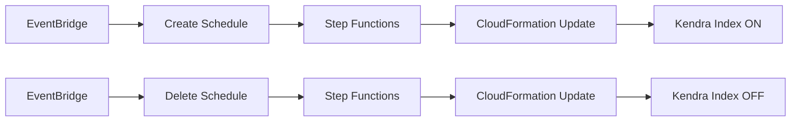

# Amazon Kendra RAGシステム アーキテクチャドキュメント

## 概要

本ドキュメントでは、Generative AI Use Cases における Amazon Kendra を利用したRAG（Retrieval Augmented Generation）システムの詳細なアーキテクチャ、実装、および運用について説明します。

## 目次

1. [システム概要](#システム概要)
2. [アーキテクチャ](#アーキテクチャ)
3. [コンポーネント詳細](#コンポーネント詳細)
4. [RAGワークフロー](#ragワークフロー)
5. [プロンプト戦略](#プロンプト戦略)
6. [設定管理](#設定管理)
7. [セキュリティ](#セキュリティ)
8. [運用・監視](#運用監視)
9. [トラブルシューティング](#トラブルシューティング)

## システム概要

### 機能概要

Amazon Kendra RAGシステムは、企業の文書を検索可能にし、LLMと組み合わせて正確な回答を生成するシステムです。主な特徴：

- **高精度な文書検索**: Amazon Kendra の機械学習技術による意味理解
- **多言語対応**: 日本語を含む多言語文書の処理
- **セキュアなアクセス制御**: Cognito JWT認証による細かいアクセス制御
- **コスト最適化**: スケジュール機能による自動的なリソース管理
- **リアルタイム処理**: WebSocketベースのストリーミング応答

### サポート機能

#### RAG機能
- 質問に対する文書ベースの回答生成
- 参照文書の脚注付き表示
- 会話履歴を考慮したコンテキスト検索

#### 文書管理
- PDF、TXT、HTML、MS Office文書の自動インデックス
- S3との連携による大容量文書管理
- 増分更新による効率的な同期

#### 言語処理
- 多言語文書の自動言語検出
- 言語別フィルタリング
- クロスリンガル検索対応

## アーキテクチャ

### システム全体図



### データフロー



## コンポーネント詳細

### 1. インフラストラクチャ（CDK）

#### Kendraインデックス
**ファイル**: `packages/cdk/lib/construct/rag.ts:194-259`

```typescript
// インデックス設定
const indexProps: kendra.CfnIndexProps = {
  name: `generative-ai-use-cases-index${envSuffix}`,
  edition: 'DEVELOPER_EDITION',
  roleArn: indexRole.roleArn,
  userContextPolicy: 'USER_TOKEN',
  userTokenConfigurations: [{
    jwtTokenTypeConfiguration: {
      keyLocation: 'URL',
      userNameAttributeField: 'cognito:username',
      groupAttributeField: 'cognito:groups',
      url: `${props.userPool.userPoolProviderUrl}/.well-known/jwks.json`,
    },
  }],
};
```

**特徴**:
- **エディション**: DEVELOPER_EDITION（月間750時間の検索API呼び出し）
- **認証**: JWT トークンベースアクセス制御
- **権限**: Cognito ユーザープールとの統合
- **言語**: 多言語対応（デフォルト：日本語）

#### S3データソース
**ファイル**: `packages/cdk/lib/construct/rag.ts:167-193`

```typescript
// S3バケット設定
dataSourceBucket = new s3.Bucket(this, 'DataSourceBucket', {
  blockPublicAccess: s3.BlockPublicAccess.BLOCK_ALL,
  encryption: s3.BucketEncryption.S3_MANAGED,
  autoDeleteObjects: true,
  removalPolicy: RemovalPolicy.DESTROY,
  objectOwnership: s3.ObjectOwnership.OBJECT_WRITER,
  serverAccessLogsBucket: accessLogsBucket,
  serverAccessLogsPrefix: 'AccessLogs/',
  enforceSSL: true,
});
```

**特徴**:
- **セキュリティ**: パブリックアクセス無効、SSL強制
- **暗号化**: S3マネージド暗号化
- **ログ**: アクセスログの自動記録
- **自動削除**: スタック削除時の自動クリーンアップ

#### データソース設定

```typescript
const dataSourceProps: kendra.CfnDataSourceProps = {
  indexId: index.attrId,
  type: 'S3',
  name: 's3-data-source',
  roleArn: s3DataSourceRole.roleArn,
  languageCode: kendraIndexLanguage,
  dataSourceConfiguration: {
    s3Configuration: {
      bucketName: dataSourceBucket.bucketName,
      inclusionPrefixes: ['docs'],
    },
  },
};
```

### 2. Lambda関数

#### Query Lambda
**ファイル**: `packages/cdk/lambda/queryKendra.ts`

```typescript
const attributeFilter: AttributeFilter = {
  AndAllFilters: [{
    EqualsTo: {
      Key: '_language_code',
      Value: { StringValue: LANGUAGE },
    },
  }],
};

const queryCommand = new QueryCommand({
  IndexId: INDEX_ID,
  QueryText: query,
  AttributeFilter: attributeFilter,
});
```

**機能**:
- Kendra Query APIの実行
- 言語別フィルタリング
- エラーハンドリング
- CORS対応

#### Retrieve Lambda
**ファイル**: `packages/cdk/lambda/retrieveKendra.ts`

```typescript
const retrieveCommand = new RetrieveCommand({
  IndexId: INDEX_ID,
  QueryText: query,
  AttributeFilter: attributeFilter,
});
```

**機能**:
- Kendra Retrieve APIの実行
- 文書パッセージの取得
- 言語フィルタリング
- メタデータ付与

### 3. フロントエンド（React）

#### RAG Hook
**ファイル**: `packages/web/src/hooks/useRag.ts`

```typescript
export const arrangeItems = (items: RetrieveResultItem[]): RetrieveResultItem[] => {
  const res: Record<string, RetrieveResultItem> = {};
  
  for (const item of items) {
    const key = uniqueKeyOfItem(item);
    if (res[key]) {
      res[key].Content += ' ... ' + item.Content;
    } else {
      res[key] = item;
    }
  }
  
  return Object.values(res);
};
```

**機能**:
- 文書の重複排除と統合
- 会話履歴の管理
- 非同期処理とローディング状態
- エラーハンドリング

## RAGワークフロー

### 1. クエリ準備フェーズ



**処理内容**:
1. **履歴分析**: 過去の質問から文脈を理解
2. **クエリ最適化**: 30トークン以内の効率的なクエリに変換
3. **主語補完**: 不明確な参照を履歴から補完

### 2. 文書検索フェーズ



**処理内容**:
1. **Retrieve API**: Kendraの高精度な文書検索
2. **言語フィルタ**: `_language_code`による言語別検索
3. **結果統合**: 同一文書の複数パッセージをマージ
4. **メタデータ保持**: ページ番号、URI等の情報維持

### 3. 回答生成フェーズ



**処理内容**:
1. **プロンプト構築**: 文書をJSON形式でLLMに提供
2. **制約付き推論**: 文書外情報の使用を制限
3. **ソース管理**: 回答の各部分に対するソース追跡
4. **脚注生成**: 参照文書への自動リンク生成

## プロンプト戦略

### 1. 検索クエリ生成プロンプト

**ファイル**: `packages/web/src/prompts/claude.ts:198-219`

```typescript
const retrievePrompt = `You are an AI assistant that generates queries for document retrieval.
Please generate a query following the <Query generation steps></Query generation steps>.

<Query generation steps>
* Please understand the content of <Query history></Query history>
* Ignore queries that are not questions
* For queries like "What is 〜?", replace them with "Overview of 〜"
* Generate a query within 30 tokens based on the newest query
* If the output query does not have a subject, add a subject
* Use the content of <Query history> to complement the subject or background
* Do not use the suffixes "About 〜", "Tell me about 〜", "Explain 〜"
* Output only the generated query
</Query generation steps>`;
```

**設計思想**:
- **簡潔性**: 30トークン制限による効率的な検索
- **文脈保持**: 会話履歴からの情報補完
- **形式統一**: 疑問文を説明形式に変換

### 2. 回答生成プロンプト

**ファイル**: `packages/web/src/prompts/claude.ts:221-265`

```typescript
const answerPrompt = `You are an AI assistant that answers questions for users.

<Answer rules>
* Do not respond to casual conversations or greetings
* Please answer based on <Reference documents>
* Add the SourceId in the format [^<SourceId>] to the end of the answer
* If you cannot answer based on <Reference documents>, output only "I could not find the information needed to answer the question."
* Do not output any text other than the answer
* Your response will be rendered in Markdown
</Answer rules>`;
```

**設計思想**:
- **制約ベース**: 文書外の情報使用を明示的に禁止
- **透明性**: すべての回答にソース情報を付与
- **品質保証**: 情報不足時の明確なエラー応答

### 3. 文書フォーマット

```json
{
  "SourceId": 0,
  "DocumentId": "document-123",
  "DocumentTitle": "製品仕様書",
  "Content": "本製品の仕様は以下の通りです..."
}
```

**特徴**:
- **構造化**: JSON形式による明確な文書構造
- **追跡可能**: SourceIdによる参照元管理
- **メタデータ**: タイトルやIDによる文書識別

## 設定管理

### CDK設定パラメータ

**ファイル**: `packages/cdk/lib/stack-input.ts:91-111`

```typescript
// RAG基本設定
ragEnabled: z.boolean().default(false),
kendraIndexLanguage: z.string().default('ja'),
kendraIndexArn: z.string().nullish(),
kendraDataSourceBucketName: z.string().nullish(),

// スケジュール設定
kendraIndexScheduleEnabled: z.boolean().default(false),
kendraIndexScheduleCreateCron: z.object({
  minute: z.string(),
  hour: z.string(),
  month: z.string(),
  weekDay: z.string(),
}).nullish(),
kendraIndexScheduleDeleteCron: z.object({
  minute: z.string(),
  hour: z.string(),
  month: z.string(),
  weekDay: z.string(),
}).nullish(),
```

### 環境変数

#### Lambda環境変数
```typescript
environment: {
  INDEX_ID: kendraIndexId,
  LANGUAGE: kendraIndexLanguage,
}
```

#### 設定例

```yaml
# cdk.json
{
  "ragEnabled": true,
  "kendraIndexLanguage": "ja",
  "kendraIndexScheduleEnabled": true,
  "kendraIndexScheduleCreateCron": {
    "minute": "0",
    "hour": "9",
    "month": "*",
    "weekDay": "MON-FRI"
  },
  "kendraIndexScheduleDeleteCron": {
    "minute": "0", 
    "hour": "18",
    "month": "*",
    "weekDay": "MON-FRI"
  }
}
```

### 言語設定

#### サポート言語
- **日本語** (ja): デフォルト設定
- **英語** (en): 完全サポート
- **中国語** (zh): ベータサポート
- **その他**: 部分サポート

#### 言語フィルタリング設定

```typescript
const attributeFilter: AttributeFilter = {
  AndAllFilters: [{
    EqualsTo: {
      Key: '_language_code',
      Value: { StringValue: LANGUAGE },
    },
  }],
};
```

## セキュリティ

### 1. 認証・認可

#### Cognito JWT認証
```typescript
userTokenConfigurations: [{
  jwtTokenTypeConfiguration: {
    keyLocation: 'URL',
    userNameAttributeField: 'cognito:username',
    groupAttributeField: 'cognito:groups',
    url: `${props.userPool.userPoolProviderUrl}/.well-known/jwks.json`,
  },
}]
```

**特徴**:
- **トークンベース**: JWTによる無状態認証
- **グループ管理**: Cognitoグループによる権限制御
- **自動検証**: JWKS による署名検証

#### IAM権限

```typescript
// Kendraアクセス権限
queryFunction.role?.addToPrincipalPolicy(
  new iam.PolicyStatement({
    effect: iam.Effect.ALLOW,
    resources: [kendraIndexArn],
    actions: ['kendra:Query', 'kendra:Retrieve'],
  })
);

// S3アクセス権限  
s3DataSourceRole.addToPolicy(
  new iam.PolicyStatement({
    effect: iam.Effect.ALLOW,
    resources: [`arn:aws:s3:::${dataSourceBucket.bucketName}/*`],
    actions: ['s3:GetObject'],
  })
);
```

### 2. データ保護

#### 暗号化
- **転送時**: HTTPS/TLS 1.2以上
- **保存時**: S3マネージド暗号化
- **メモリ**: Lambda実行時の一時的な暗号化

#### アクセス制御
```typescript
// S3バケットセキュリティ
blockPublicAccess: s3.BlockPublicAccess.BLOCK_ALL,
enforceSSL: true,
```

### 3. 監査・ログ

#### CloudTrail連携
- API呼び出しの全記録
- 文書アクセスログ
- 認証イベント追跡

#### S3アクセスログ
```typescript
serverAccessLogsBucket: accessLogsBucket,
serverAccessLogsPrefix: 'AccessLogs/',
```

## 運用・監視

### 1. スケジュール機能

#### 自動インデックス管理



**機能**:
- **自動作成**: 業務時間開始時にインデックス作成
- **自動削除**: 業務時間終了時にインデックス削除
- **コスト最適化**: 使用しない時間のコスト削減

#### Step Functions定義

```typescript
const taskUpdateCloudformationStackWithKendraOn = new stepfunctionsTasks.CallAwsService(
  this, 'TaskUpdateCloudformationStackWithKendraOn', {
    service: 'cloudformation',
    action: 'updateStack',
    parameters: {
      StackName: cdk.Stack.of(this).stackName,
      UsePreviousTemplate: true,
      Parameters: [{
        ParameterKey: KENDRA_STATE_CFN_PARAMETER_NAME,
        ParameterValue: 'on',
      }],
      Capabilities: ['CAPABILITY_IAM'],
    },
  }
);
```

### 2. 監視・アラート

#### CloudWatch メトリクス
- **検索API呼び出し数**: 月間制限の監視
- **レスポンス時間**: パフォーマンス監視
- **エラー率**: 可用性監視
- **文書数**: インデックスサイズ監視

#### カスタムメトリクス

```typescript
// Lambda内でのメトリクス出力例
const cloudwatch = new CloudWatchClient({});
await cloudwatch.send(new PutMetricDataCommand({
  Namespace: 'GenerativeAI/RAG',
  MetricData: [{
    MetricName: 'SearchLatency',
    Value: responseTime,
    Unit: 'Milliseconds',
  }],
}));
```

### 3. バックアップ・災害復旧

#### データソースバックアップ
- S3クロスリージョンレプリケーション
- バージョニング有効化
- ライフサイクル管理

#### 設定バックアップ
- CDKコードによるIaC管理
- Git履歴による変更追跡
- 環境間設定同期

## トラブルシューティング

### 1. よくある問題と対処法

#### 検索結果が返らない

**症状**: 
```javascript
// useRag.ts:113-118
if (items.length == 0) {
  popMessage();
  pushMessage('assistant', t('rag.noDocuments'));
  setLoading(false);
  return;
}
```

**原因と対処**:

1. **言語設定ミスマッチ**
   ```typescript
   // 解決方法: 言語設定確認
   const attributeFilter: AttributeFilter = {
     AndAllFilters: [{
       EqualsTo: {
         Key: '_language_code',
         Value: { StringValue: 'ja' }, // 正しい言語コード
       },
     }],
   };
   ```

2. **文書インデックス未完了**
   ```bash
   # データソース同期状況確認
   aws kendra describe-data-source \
     --index-id <INDEX_ID> \
     --id <DATA_SOURCE_ID>
   ```

3. **クエリ品質問題**
   ```typescript
   // クエリ生成ログ確認
   console.log('Generated query:', query);
   ```

#### 認証エラー

**症状**: 401 Unauthorized

**対処法**:
1. **JWT設定確認**
   ```typescript
   // cognito設定確認
   userTokenConfigurations: [{
     jwtTokenTypeConfiguration: {
       url: `${props.userPool.userPoolProviderUrl}/.well-known/jwks.json`,
     },
   }]
   ```

2. **IAM権限確認**
   ```typescript
   // 必要な権限
   actions: ['kendra:Query', 'kendra:Retrieve']
   ```

#### パフォーマンス問題

**症状**: レスポンス時間が長い

**対処法**:
1. **クエリ最適化**
   ```typescript
   // 30トークン制限の確認
   // packages/web/src/prompts/claude.ts:207
   * Generate a query within 30 tokens
   ```

2. **文書統合処理の最適化**
   ```typescript
   // useRag.ts:22-39
   export const arrangeItems = (items: RetrieveResultItem[]): RetrieveResultItem[] => {
     // 重複排除ロジックの最適化
   };
   ```

### 2. ログ分析

#### Lambda関数ログ

```bash
# CloudWatchログ確認
aws logs describe-log-groups --log-group-name-prefix "/aws/lambda/GenerativeAiUseCases"

# エラーログ検索
aws logs filter-log-events \
  --log-group-name "/aws/lambda/GenerativeAiUseCases-Query" \
  --filter-pattern "ERROR"
```

#### Kendraログ

```bash
# データソース同期ログ
aws kendra list-data-source-sync-jobs \
  --index-id <INDEX_ID> \
  --id <DATA_SOURCE_ID>
```

### 3. デバッグ設定

#### ローカル開発

```typescript
// 開発環境でのデバッグ設定
if (process.env.NODE_ENV === 'development') {
  console.log('Query:', query);
  console.log('Retrieved items:', items);
  console.log('Arranged items:', arrangedItems);
}
```

#### テスト用データ

```typescript
// packages/cdk/lib/construct/rag.ts:180-192
new s3Deploy.BucketDeployment(this, 'DeployDocs', {
  sources: [s3Deploy.Source.asset('./rag-docs')],
  destinationBucket: dataSourceBucket,
  exclude: [
    'AccessLogs/*',
    'logs*',
    'docs/bedrock-ug.pdf.metadata.json',
    'docs/nova-ug.pdf.metadata.json',
  ],
});
```

## まとめ

Amazon Kendra RAGシステムは、高精度な文書検索と生成AIを組み合わせた強力なソリューションです。適切な設定と運用により、企業の知識管理とAI活用を大幅に向上させることができます。

### 主な利点

1. **高精度な検索**: Kendraの機械学習による意味理解
2. **セキュアな実装**: 多層防御によるデータ保護
3. **コスト効率**: スケジュール機能による最適化
4. **スケーラビリティ**: AWSマネージドサービスの活用
5. **保守性**: Infrastructure as Codeによる管理

### 今後の拡張可能性

- **多言語拡張**: 追加言語サポート
- **高度な検索**: ベクトル検索との組み合わせ
- **リアルタイム更新**: 文書変更の即座な反映
- **分析機能**: 検索パターンの可視化
- **API拡張**: 外部システムとの連携

本ドキュメントが、Amazon Kendra RAGシステムの理解と効果的な活用に役立つことを期待します。